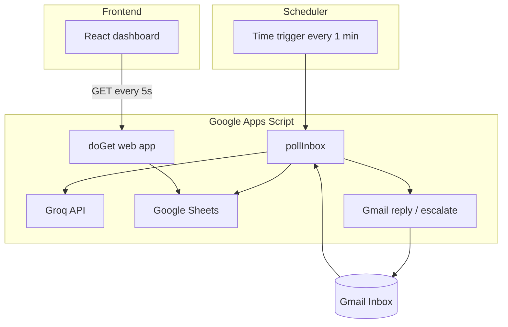

# AI Email Triage Agent

An end-to-end email triage system for a university student-services inbox. Incoming Gmail messages are classified with Groq, acted on automatically (reply, clarify, or escalate), logged to Google Sheets, and monitored through a React dashboard.

Built as a lightweight MVP: no dedicated backend server—Gmail, scheduling, LLM calls, and the read API all run in **Google Apps Script**.

---

## Table of Contents

- [Overview](#overview)
- [Features](#features)
- [Architecture](#architecture)
- [How It Works](#how-it-works)
- [Prerequisites](#prerequisites)
- [Project Structure](#project-structure)
- [Setup](#setup)
- [Configuration](#configuration)
- [Running the Dashboard](#running-the-dashboard)
- [Demo](#demo)
- [API](#api)
- [Testing](#testing)
- [Known Limitations](#known-limitations)
- [Troubleshooting](#troubleshooting)
- [Updating Apps Script](#updating-apps-script)

---

## Overview

| Component | Technology |
|-----------|------------|
| Email ingestion & actions | Google Apps Script (`GmailApp`) |
| Classification | Groq API (`llama3-70b-8192`) |
| Audit log | Google Sheets |
| Dashboard | Vite, React, Tailwind CSS |

The agent runs on a **one-minute time trigger**, processes unread inbox messages, and applies one of three actions:

| Action | Behavior |
|--------|----------|
| `auto_reply` | Sends a direct answer to the sender |
| `clarify` | Asks for missing information; thread stays open for follow-ups |
| `escalate` | Acknowledges the sender and notifies a human support address |

---

## Features

- Automated triage with structured JSON output from the LLM
- Full audit trail in Google Sheets (intent, entities, confidence, raw model response)
- Live dashboard with status filters and email detail modal
- Thread-aware processing for multi-message conversations (e.g. clarify → user reply)
- Per-message deduplication via stored Gmail message IDs
- Frontend unit tests for triage rules and dashboard statistics

---

## Architecture



---

## How It Works

1. **Poll** — `pollInbox` searches for unread inbox messages within the configured lookback window (excluding threads labeled `ai-triaged`).
2. **Classify** — Message content and thread history are sent to Groq with a fixed JSON schema.
3. **Act** — The script replies, asks a clarifying question, or escalates to `HUMAN_SUPPORT_EMAIL`.
4. **Log** — A row is appended to the `emails` sheet with status and model output.
5. **Close or continue** — After `auto_reply` or `escalate`, the thread is labeled `ai-triaged`. After `clarify`, only the message is marked read so follow-up replies can be processed.

---

## Prerequisites

- A Google account with Gmail and Google Sheets
- A [Groq](https://console.groq.com/) API key
- Node.js 18+ (for the frontend only)
- Google Apps Script project (paste code from `apps-script/Code.gs`)

---

## Project Structure

```
emailagentproject/
├── apps-script/
│   └── Code.gs              # Backend: poll, Groq, Gmail, Sheets, doGet
├── frontend/
│   ├── src/
│   │   ├── components/      # Dashboard UI
│   │   ├── hooks/           # Polling hook
│   │   ├── lib/             # Triage helpers + Vitest tests
│   │   └── services/        # Apps Script API client
│   └── package.json
├── DEMO.md                  # Sample emails for live demos
└── README.md
```

---

## Setup

### 1. Google Sheet

Create a spreadsheet and copy its ID from the URL:

`https://docs.google.com/spreadsheets/d/<SPREADSHEET_ID>/edit`

**Important:** `setupSheet()` in Apps Script creates a **new** spreadsheet each time it runs. For an existing sheet, add the `emails` tab manually with the column headers defined in `Code.gs`, or run `setupSheet()` once and then set `SPREADSHEET_ID` to the ID it logs.

### 2. Apps Script

1. Go to [script.google.com](https://script.google.com) and create a project.
2. Replace the default code with [`apps-script/Code.gs`](apps-script/Code.gs).
3. Open **Project settings → Script properties** and add the variables in [Configuration](#configuration).
4. Run **`setupTrigger()`** once to install the minute-based trigger.  
   Do not run `setupTrigger()` repeatedly unless you intend to reset triggers (it deletes all existing project triggers first).

### 3. Deploy the web app

1. **Deploy → New deployment → Web app**
2. Execute as: **Me**
3. Who has access: **Anyone** (required for the dashboard URL in this MVP)
4. Copy the deployment URL for the frontend.

After code changes, update the deployment to a **new version** (see [Updating Apps Script](#updating-apps-script)).

### 4. Frontend

```bash
cd frontend
cp .env.example .env      # then edit .env
npm install
npm run dev
```

Set `VITE_APPS_SCRIPT_URL` in `frontend/.env` to the web app URL from step 3.

---

## Configuration

### Apps Script (Script properties)

| Property | Required | Description |
|----------|----------|-------------|
| `GROQ_API_KEY` | Yes | Groq API key |
| `SPREADSHEET_ID` | Yes | Target Google Sheet ID |
| `HUMAN_SUPPORT_EMAIL` | Recommended | Recipient for escalation notifications |
| `POLL_LOOKBACK_MINUTES` | No | How far back to search for unread mail (default: `10`) |

Apps Script does **not** read `.env` files. Values must be set in the Apps Script UI.

### Frontend (`frontend/.env`)

```env
VITE_APPS_SCRIPT_URL=https://script.google.com/macros/s/YOUR_DEPLOYMENT_ID/exec
```

Never commit `frontend/.env`. Do not prefix `GROQ_API_KEY` with `VITE_` or it may be bundled into the client build.

Reference: [`frontend/.env.example`](frontend/.env.example)

---

## Running the Dashboard

| Command | Description |
|---------|-------------|
| `npm run dev` | Local development server |
| `npm run build` | Production build (`frontend/dist/`) |
| `npm run preview` | Preview production build |
| `npm test` | Run Vitest unit tests |

Deploy `frontend/` to any static host (e.g. Vercel). Set `VITE_APPS_SCRIPT_URL` at **build time**.

---

## Demo

See [DEMO.md](DEMO.md) for three sample messages (auto-reply, clarify, escalate) and how to verify results in the dashboard and spreadsheet.

**Clarify follow-up:** Reply in the same thread with the requested information. The agent processes each unread message separately and sends the full thread to Groq for context.

---

## API

The deployed web app exposes:

| Request | Response |
|---------|----------|
| `GET ?action=list` (default) | `{ updatedAt, rows }` — all rows from the `emails` sheet |
| `GET ?action=health` | `{ ok: true, timestamp }` |

There is no authentication on this endpoint in the MVP. Treat the deployment URL as sensitive.

---

## Testing

```bash
cd frontend
npm test
```

Tests cover:

- `frontend/src/lib/triageRules.js` — decision normalization (e.g. low confidence → escalate)
- `frontend/src/lib/emailStats.js` — dashboard stat aggregation

Apps Script itself is validated manually via **Executions** in the Apps Script editor and test emails.

---

## Known Limitations

This project is intended for **demos and personal test inboxes**, not production use with real student PII without further hardening.

| Area | Limitation |
|------|------------|
| Security | Public `doGet` endpoint; no API token |
| Trust model | Triage rules are primarily in the LLM prompt; Apps Script does not fully re-validate before send |
| Prompt injection | Raw email bodies are passed to the model |
| Delivery | Time-based polling, not Gmail push notifications |
| Concurrency | No `LockService`; overlapping triggers may rarely double-process |
| Quotas | Gmail send limits apply (~100/day for typical consumer accounts via Apps Script) |

**Production checklist:** authenticate `doGet`, enforce policy in code, add idempotency, use push notifications, human-in-the-loop before outbound mail, and restrict deployment access.

---

## Troubleshooting

| Symptom | Likely cause | What to do |
|---------|----------------|------------|
| Dashboard empty, no error banner | Missing `VITE_APPS_SCRIPT_URL` | Create `frontend/.env`, restart `npm run dev` |
| “Failed to load emails” | Bad URL, revoked deployment, or network | Redeploy web app; update URL; check browser network tab |
| Emails never process | Trigger not installed | Run `setupTrigger()` once; check **Triggers** in Apps Script |
| Groq / `failed` status | Invalid key, quota, or model name | Verify `GROQ_API_KEY` and model in `Code.gs` |
| Follow-up after clarify ignored | Thread labeled `ai-triaged` from older code | Remove `ai-triaged` label in Gmail; deploy latest `Code.gs` |
| `Service invoked too many times for one day: email` | Gmail daily send quota exceeded | Wait for quota reset; disable trigger while debugging; avoid repeated `pollInbox` runs |
| Duplicate rows or replies | Testing before dedupe / failure fixes | Mark test threads read; remove `ai-triaged`; use latest `Code.gs` |

**Manual test:** In Apps Script, run `pollInbox()` once and inspect **Executions** for errors.

---

## Updating Apps Script

| Change type | Action |
|-------------|--------|
| Backend logic (`pollInbox`, Groq, Gmail) | Save in editor — trigger uses latest code automatically |
| Dashboard API (`doGet`) | **Deploy → Manage deployments → Edit → New version → Deploy** |
| `setupSheet()` | Only run when creating a new spreadsheet |
| `setupTrigger()` | Only run if the minute trigger is missing |

You usually do **not** need a new deployment URL after updating an existing web app deployment.

---

## License

Add a license file if you plan to open-source this repository. Until then, all rights reserved by the author.
