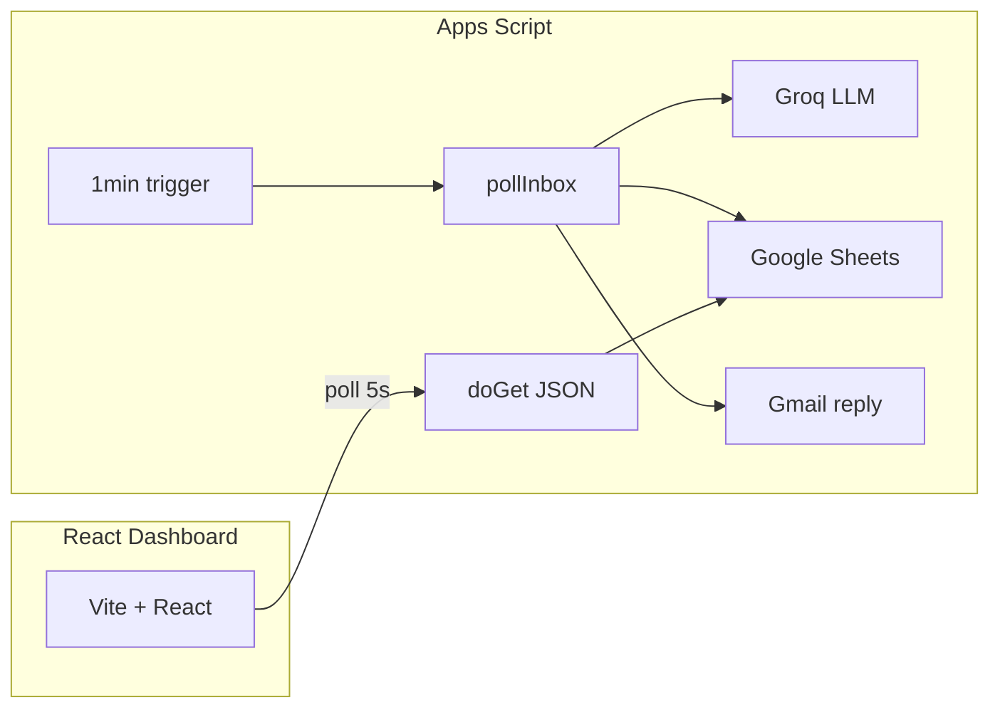

# AI Email Triage Agent

Monitors Gmail, classifies incoming emails with Groq, writes results to Google Sheets, and shows a live React dashboard.

Built as a one-day MVP for an internship demo: end-to-end agent loop on Google Apps Script with no separate backend server.

## Layout

- `apps-script/` — Google Apps Script backend (Gmail, Groq, Sheets, web API)
- `frontend/` — Vite + React dashboard
- `DEMO.md` — sample emails to send during a live demo

## Architecture



**Flow:** Time trigger runs `pollInbox` → unread inbox messages (excluding `ai-triaged` label) → Groq classifies and chooses `auto_reply`, `clarify`, or `escalate` → row written to Sheets → Gmail reply / human notification → dashboard polls `doGet` for JSON.

## What this MVP does

- Polls unread Gmail messages on a time trigger (every 1 minute)
- Sends email content to Groq (`llama3-70b-8192`) for classification and action selection
- Stores each processed email in Google Sheets with raw Groq JSON
- Auto-replies, asks a clarifying question, or escalates to human support
- Serves dashboard data from Apps Script as JSON
- React dashboard polls every 5 seconds

## What you need to provide

- Groq API key
- Google Sheet ID (existing spreadsheet — see setup warning below)
- Gmail account to monitor
- Human support email address for escalations
- Google Apps Script deployment URL

Google Sheets API key is **not** required; the dashboard reads from the Apps Script JSON endpoint.

## Env files

- Use [`.env.example`](.env.example) as the reference list of all values.
- Put `VITE_APPS_SCRIPT_URL` into `frontend/.env` (never commit this file).
- Copy `GROQ_API_KEY`, `SPREADSHEET_ID`, `HUMAN_SUPPORT_EMAIL`, and `POLL_LOOKBACK_MINUTES` into **Apps Script → Project settings → Script properties**.
- Apps Script cannot read `.env` files at runtime.

## Setup order

1. Create or choose a Google Sheet and note its ID.
2. Paste [`apps-script/Code.gs`](apps-script/Code.gs) into a Google Apps Script project bound to that sheet (or standalone).
3. Set script properties.
4. Run setup functions once (see below).
5. Deploy the web app and copy the URL into `frontend/.env`.
6. Start the frontend locally or deploy to Vercel.

## Exact setup

### 1. Google Sheet

**Recommended:** Create a spreadsheet yourself, copy its ID from the URL, and set `SPREADSHEET_ID` in Script Properties.

**Warning:** `setupSheet()` creates a **new** spreadsheet every time it runs. Use it only for a fresh install, then set `SPREADSHEET_ID` to that new ID—or skip `setupSheet()` if you already have an `emails` sheet with the correct headers (see `Code.gs` `setupSheet` for column names).

### 2. Apps Script script properties

| Property | Description |
|----------|-------------|
| `GROQ_API_KEY` | Your Groq API key |
| `SPREADSHEET_ID` | Google Sheet ID from the URL |
| `HUMAN_SUPPORT_EMAIL` | Where escalation notifications are sent |
| `POLL_LOOKBACK_MINUTES` | Optional; default `10` |

### 3. Functions to run once

In the Apps Script editor, run manually in order:

1. `setupSheet()` — only if you need a new sheet with headers
2. `setupTrigger()` — installs the 1-minute `pollInbox` trigger

### 4. Apps Script deployment

- Deploy → New deployment → Web app
- Execute as: **Me**
- Who has access: **Anyone** (required for the public dashboard URL in this MVP)
- Copy the deployment URL

### 5. Frontend env file

Create `frontend/.env`:

```env
VITE_APPS_SCRIPT_URL=https://script.google.com/macros/s/your-deployment-id/exec
```

### 6. Frontend run / deploy

```bash
cd frontend
npm install
npm run dev
```

```bash
npm run build    # production build
npm test         # unit tests (Vitest)
```

Deploy the `frontend/` folder to Vercel (or any static host). Set `VITE_APPS_SCRIPT_URL` in the host’s environment at build time.

## Demo

See [DEMO.md](DEMO.md) for three sample emails (auto-reply, clarify, escalate) and how to verify them on the dashboard and in Sheets.

## Known limitations (demo vs production)

This MVP is suitable for a **personal demo inbox**, not production student data without further hardening.

| Limitation | Notes |
|------------|--------|
| **Public read API** | `doGet` has no auth; anyone with the deployment URL can read triage rows. The URL is embedded in the frontend build. |
| **Prompt injection** | Email bodies are sent to the LLM as-is; malicious senders could try to override instructions. |
| **Policy in prompt only** | Rules like “confidence &lt; 70 → escalate” are in the Groq system prompt; Apps Script does not re-validate before sending Gmail replies. |
| **Polling, not push** | 1-minute trigger; not Gmail push notifications. |
| **Concurrent runs** | No `LockService`; overlapping triggers could rarely double-process. |

For production you would add: API token on `doGet`, server-side policy checks, idempotency by `email_id`, Gmail push or Pub/Sub, and human approval before send.

## Troubleshooting

| Symptom | Likely cause | Fix |
|---------|----------------|-----|
| Dashboard empty, no error | `VITE_APPS_SCRIPT_URL` missing | Create `frontend/.env` and restart `npm run dev` |
| Dashboard shows “No emails” but env is set | No rows yet or wrong sheet ID | Send a test email; confirm `SPREADSHEET_ID`; run `pollInbox()` once |
| “Failed to load emails” | Bad URL, deployment revoked, or network | Redeploy web app; copy new URL; check browser network tab |
| Emails never process | Trigger not installed | Run `setupTrigger()` once; check Triggers in Apps Script |
| Groq errors / `failed` status | Invalid key, quota, or deprecated model | Verify `GROQ_API_KEY`; check Groq dashboard and model name in `Code.gs` |
| Duplicate failure replies | Old behavior before failure labeling fix | Ensure latest `Code.gs` labels threads on failure; mark stuck threads `ai-triaged` manually |
| Follow-up after clarify ignored | Thread still has `ai-triaged` from older code | Remove the `ai-triaged` label from that Gmail thread once; redeploy latest `Code.gs` (clarify no longer closes the thread) |
| `setupSheet()` created wrong sheet | Ran setup on existing project | Use one sheet ID in Script Properties; do not re-run `setupSheet()` unless intentional |

## What the dashboard reads

- `GET ?action=list` (default) — JSON `{ updatedAt, rows }` from the `emails` sheet
- `GET ?action=health` — `{ ok, timestamp }`

## Development

```bash
cd frontend
npm install
npm run dev
npm test
```

Pure triage helpers live in `frontend/src/lib/` with Vitest tests in `frontend/src/lib/*.test.js`.

## Notes

- Processed threads get the Gmail label `ai-triaged` to reduce duplicates.
- On processing failure, a fallback reply is sent and the thread is still labeled to avoid infinite retries (see `processMessage` in `Code.gs`).
- Frontend policy helpers in `triageRules.js` mirror intended rules for tests and documentation; the live agent still uses Groq + Apps Script as deployed.
